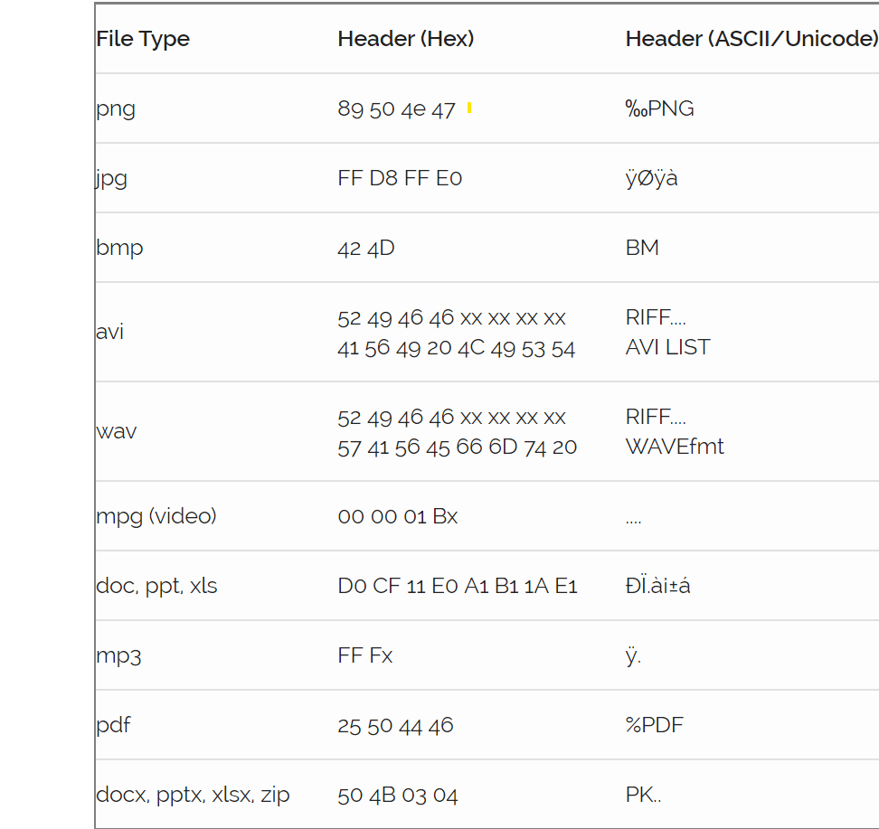
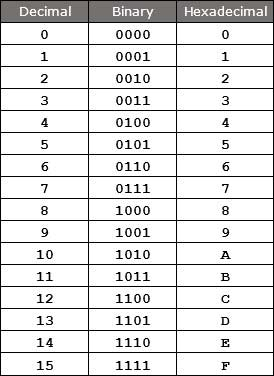
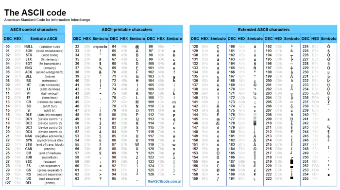
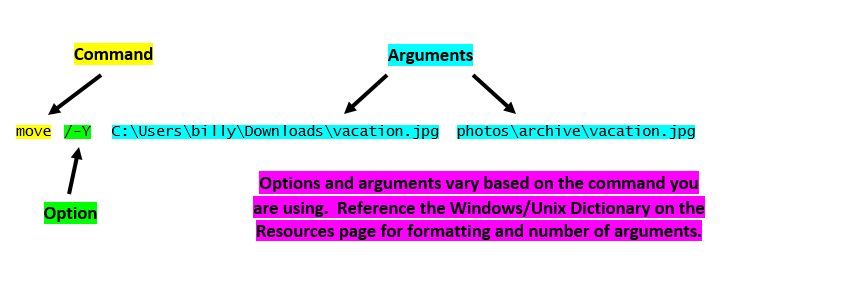
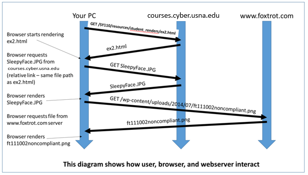
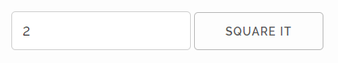

# SY110 6-Week Review

24SEP2023

---

### DISCLAIMER
- I do *not* know what is on the exam
- This review does not cover *every single topic/concept* in detail
- DYOR

---
## Early Beginnings - Hardware

- **Difference Engine** - decimal-based mechanical calculator, created by Charles Babbage
- **Analytical Engine** - punch-card system to run arithmetic tasks, designed by Charles Babbage
- **Turing Machine** - used binary pair of symbols to perform any mathematical computation if it were representable by an algorithm
- **Electronic Numerical Integrator and Computer (ENIAC)** - built by University of Pennsylvania in 1946, first general-purpose electronic computer, covered 1000 sqft and was programmed with dials, cables, and switches
- **Universal Automatic Computer (UNIVAC)** - first all-electronic digital computer
- **ARPANET** - connected computers between universitys and research centers
- **phone phreaks** - hijacked the telephone system for the own purposes

<!-- footer: '[Lecture 1](https://courses.cyber.usna.edu/SY110/calendar.php?type=class&event=1)' -->

---

## Early Beginnings - People

- **Charles Babbage** - Cambridge mathematician that created Difference Engine and Analytical Engine
- **Ada Lovelace** - mathematician, often credited as first computer programmer
- **Alan Turing** - Cambridge mathematician, laid the groundwork for modern digital computers, contributed to cracking the Enigma code in WWII
- **Rear Admiral Grace Hopper** - credited for use of the word "bug" for computer glitch after finding moth in relay contact of Harvard Mark II; creator of COBOL programming language
- **John Draper (Cap'n Crunch)** - discovered that 2600 Hz tone from whistle from box of cereal would provider Operator Mode to phone network
- **Steve Jobs and Steve Wozniak** - early phone phreakers that would later found Apple Computers
- **Ken Thompson & Dennis Ritchie** - created UNIX operating system while working at Bell Labs
- **Tim Berners-Lee** - British scientist working at CERN, credited with creating the first website
- **Linus Torvalds** - created Linux OS, released the source code for free

<!-- footer: '[Lecture 1](https://courses.cyber.usna.edu/SY110/calendar.php?type=class&event=1)' -->

---

## Hacker Ethic

- Access to computers is a right
- Hackers should be judged by their abilities rather than criteria such as degrees, age, sex/gender, race, or position
- A do-it-yourself mentality of exploration and manipulation
- General disregard for traditional rules and norms
- An assumption that information should be open and available; the burden of proof is on those who want to maintain confidentiality (e.g. governments, corporations)
- The use of anonymity (e.g. nicknames, anonymizing protocols) to protect against unjustified coercion by authorities
- Distrust of authority—promote decentralization
- The sharing of innovations among other like-minded individuals

<!-- footer: '[Lecture 1](https://courses.cyber.usna.edu/SY110/calendar.php?type=class&event=1)' -->

---

## President's 60-Day Cyberspace Policy Review

In May of 2009, President Obama directed a 60-Day Cyberspace Policy Review which among a variety of recommendations included an action item to "*expand and train the workforce, including ... cyber security expertise in the Federal government*"

In the fall semester of 2011, the Superintendent of the United States Naval Academy directed that an *Introduction to Cyber Security* course be added as part of the core curriculum for all Midshipmen to fulfill the action item from the *2009 60-Day Cyberspace Policy Review*


<!-- footer: '[Lecture 1](https://courses.cyber.usna.edu/SY110/calendar.php?type=class&event=1)' -->

---

## Cyber Domain - Definition

- **Common**: "*the domain characterized by the 'human' use of electronics and the electromagnetic spectrum to store, modify, and exchange data via networked systems and associated physical infrastructures*"
- **DoD (JP 3-12)**: "*a global domain within the information environment consisting of the interdependent networks of information technology infrastructures and resident data, including the Internet, telecommunications networks, computer systems, and embedded processors and controllers*"

<!-- footer: '[Lecture 1](https://courses.cyber.usna.edu/SY110/calendar.php?type=class&event=1)' -->

---

## Cyberspace Model

- **Physical Network Layer** - hardware and infrastructure that provide storage, transport, and processing of information within cyberspace
- **Logical Network Layer** - elements related to one another in a way that is abstracted from physical network, based on the logic programming (code)
- **Cyber-Persona Layer** - digital representaions of an actor or entity, consists of user accounts (human or automated)

<!-- footer: '[Lecture 1](https://courses.cyber.usna.edu/SY110/calendar.php?type=class&event=1)' -->

---


<!-- footer: '[Lecture 1](https://courses.cyber.usna.edu/SY110/calendar.php?type=class&event=1)' -->

---

## Major Cyber Security Incidents

- **Operation Rolling Tide**: Navy's first offically named Cyber Operation in response to Iranian intrusion into an unclassified Navy network
- **Office of Personel Management (OPM) Hack**: breach and data theft that affected an estimated 22 million government employees; most only had their security clearance file information stolen, but an estimated 4 million also had SSNs, addresses, fingerprints, performance evaluations, and job assignment information stolen; officials suspected Chinese hackers based on investigations
- **Democratic National Committee (DNC)**: DNC staff targeted by spear-phishing emails in 2016; one successful spear-phising email allowed hackers to steal over 50,000 emails; Russian intelligence and hacking group named *Internet Research Agency*

<!-- footer: '[Lecture 1](https://courses.cyber.usna.edu/SY110/calendar.php?type=class&event=1)' -->

---

## Major Cyber Security Incidents (con't)

- **Petya and Notpeyta**: malware that affected MS Windows computers in 2016 and 2017
    - Petya - ransomware that requires victim to pay ransome to regain access to their data
    - Notpetya - similar to Petya, but only exists to prevent users from accessing their data with no hope of recovering the data
- **Equifax Hack**: in 2017 hackers used known vulnerability to exploit an unpatched system at Equifax to steal the personal data of 143 million people; brought attention to private sector's responsiblity to protect consumer data
- **Solarwinds Hack**: in 2020, hackers inserted malicious code into Solarwinds software; when Solarwinds sent out the software updates to 33,000 customers the malicious code created backdoors allow hackers to access customer systems including the National Nuclear Security Administration

<!-- footer: '[Lecture 1](https://courses.cyber.usna.edu/SY110/calendar.php?type=class&event=1)' -->

---

## Major Cyber Security Incidents (con't)

- **Colonial Pipeline Hack**: in 2021, the *Darkside* hacking group was suspected of launching a ransomware attack against the energy distribution company *Colonial Pipeline*; disruption caused increased gas prices and fears of critical infrastructure security problems
- **Apache Log4j**: 10 out of 10 in CVSS, Java based logging library used by Amazon, Apple iCloud, Cisco, Tesla, etc, allowed completed takeover of system, actively exploited at the end of 2021
- **Viasat Satellite Network**: Tens of thousands of satellite modems knocked offline by Russia momements before the crossed the border into Ukraine in February 2023 by targeting misconfigured VPN appliance

<!-- footer: '[Lecture 1](https://courses.cyber.usna.edu/SY110/calendar.php?type=class&event=1)' -->

---

## DIKW Hierarchy


<!-- footer: '[Lecture 1](https://courses.cyber.usna.edu/SY110/calendar.php?type=class&event=1)' -->

---

## Tenets of Cybersecurity

The *CIA Triad*:

- **Confidentiality**: Preserving authorized restrictions on information access and disclosure, including means for protecting personal privacy and proprietary information.
- **Integrity**: Guarding against improper information modification or destruction, and includes ensuring information non-repudiation and authenticity.
- **Availability**: Ensuring timely and reliable access to and use of information.

<!-- footer: '[Lecture 1](https://courses.cyber.usna.edu/SY110/calendar.php?type=class&event=1)' -->

---

## Components of Computer Architecture


<!-- footer: '[Lecture 2](https://courses.cyber.usna.edu/SY110/calendar.php?type=class&event=2)' -->

---

## Hardware Components

- **Central Processing Unit (CPU)** - the brain of the computer; executes instructions and controls data flow to and from other parts of the computer
- **Storage** -
    - **Random Access Memory (RAM)** - short-term memory; when you open a program it gets loaded into RAM; if the computer is shutdown, the contents in RAM are lost; faster, smaller, more expensive
    - **Hard Drive (HDD)** - long-term memory; contents remain after the computer is shutdown
- **Peripherals** - components attached to the computer to increase capabilities; e.g. keyboard, mouse, monitor, webcam, printer, scanner, etc.
- **Motherboard** - backplane that interconnects all of the hardware components

<!-- footer: '[Lecture 2](https://courses.cyber.usna.edu/SY110/calendar.php?type=class&event=2)' -->

---

## Fetch, Decode, Execute of CPU

CPU performs the same steps over and over:
- **Fetch** the next instruction from as a block of bytes
- **Decode** the bytes to determine what action the instruction specifies
- **Execute** the action encoded in the instruction

CPU performs these steps hundreds of millions of times per second.

<!-- footer: '[Lecture 2](https://courses.cyber.usna.edu/SY110/calendar.php?type=class&event=2)' -->

---

## File Systems


<!-- footer: '[Lecture 3](https://courses.cyber.usna.edu/SY110/calendar.php?type=class&event=3)' -->


---

## Windows File Hierarchy

- **Root Drive**: typically the C drive (C:)
- **Home Directory**: `C:\Users\m279999\`


<!-- footer: '[Lecture 3](https://courses.cyber.usna.edu/SY110/calendar.php?type=class&event=3)' -->

---

## Linux File Hierarchy

- **Root Directory**: the `/` folder is the root directory
- **Home Directory**: `/home/mids/m279999`


<!-- footer: '[Lecture 3](https://courses.cyber.usna.edu/SY110/calendar.php?type=class&event=3)' -->

---

## Files

- **file**: a file on a computer is simply a sequence of bytes
- **file format**: the rules that define how the bytes of a particular file are supposed to be interpreted (e.g. JPEG files, PDF files, PowerPoint presentations, etc)
- **file extension**: the last part of the filename (e.g. .pdf, .jpg, .pptx) that operating systems (MS Windows) and programs use to tell them the file type; however, the extension does not reliably tell you the file type
- **file header**: a short sequence of data the head, or beginning, of the actual file data; viewing files in a HEX editor like frhed allows you to see the bytes of the file in HEX

<!-- footer: '[Lecture 3](https://courses.cyber.usna.edu/SY110/calendar.php?type=class&event=3)' -->

---



<!-- footer: '[Lecture 3](https://courses.cyber.usna.edu/SY110/calendar.php?type=class&event=3)' -->

---

## Bits, Bytes, and Files

Digital data consists soley of 0's and 1's

- **Bit**: an individual 0 or 1 value
- **Nibble**: a chunk of 4 bits (e.g. 0010)
- **Byte**: a chunk of 8 bits (e.g 0100 1110)
- **File**: a sequence of bytes

<!-- footer: '[Lecture 3](https://courses.cyber.usna.edu/SY110/calendar.php?type=class&event=3)' -->

---

## Number Systems

- [Intro to Number Systems - Khan Academy](https://youtu.be/ku4KOFQ-bB4)
- [Hexidecimal - Khan Academy](https://youtu.be/ku4KOFQ-bB4)
- [Decimal -> Binary - Khan Academy](https://youtu.be/H4BstqvgBow)
- [Decimal -> Binary (larger) - Khan Academy](https://youtu.be/NFmDz1dQyPU)
- [Decimal -> Hexidecimal - Khan Academy](https://youtu.be/NFmDz1dQyPU)
- [Binary -> Hexidecimal - Khan Academy](https://youtu.be/8T4F7WboWPQ)

<!-- footer: '[Lecture 4](https://courses.cyber.usna.edu/SY110/calendar.php?type=class&event=4)' -->

---



<!-- footer: '[Lecture 4](https://courses.cyber.usna.edu/SY110/calendar.php?type=class&event=4)' -->

---

## ASCII Encoding and Text

The method for representing text digitally (i.e. as bits and bytes) depends on the alphabet the text uses,

In ASCII, basic text is represented using one byte (i.e. one number in the range 0-255, although in reality we only use 0-127) for each character

<br />

> Encoding is converting data from one system of communication into another. There are other encoding schemes beyond ASCII; for example: base64, Unicode, UTF-8.

<!-- footer: '[Lecture 4](https://courses.cyber.usna.edu/SY110/calendar.php?type=class&event=4)' -->

---



<!-- footer: '[Lecture 4](https://courses.cyber.usna.edu/SY110/calendar.php?type=class&event=4)' -->


---

## Operating Systems

An Operating System (OS) is a program (or collection of programs) that manages the physical computer and the programs that run on it (programs managing programs).

Examples of Operating Systems:
- Microsoft Windows
- UNIX
- iOS
- Android

<!-- footer: '[Lecture 5](https://courses.cyber.usna.edu/SY110/calendar.php?type=class&event=5)' -->

---

## System Services

- **File Operations**: the OS manages all the different storage peripherals. The OS can create, modify, read and destroy files on behalf of other Programs
- **Network Connections**: the OS can actually send or receive data to/from a computer's wired or wireless connection
- **User Accounts, Permissions, and Logins**: the OS ensures that users log in properly and can only access the things they're supposed to
- **Processes**: the OS manages the Programs as they execute

OS is accessed via:
- **The Grahical User Interface (GUI)**: the stuff you click on or use your fingers on a touch screen to interact with
- **The Shell**: shell allows commands for the OS to be entered as plain text strings. The shell is an OS interface for both Programs and users.
- **The Application Programming Interface (API)**: direct way for a Program to ask the OS to do something. The API is an interface exclusively for Programs

<!-- footer: '[Lecture 5](https://courses.cyber.usna.edu/SY110/calendar.php?type=class&event=5)' -->

---

## Shell Command Structure



- **command name**: a shell command is a request to have a Program executed, and name is literally the name of the Program you want executed
- **command options**: special arguments that start with a / or - character in Windows (with a - character in UNIX), they modify the operation of the given command
- **command arguments**: provide the command with the information it needs to operate

<!-- footer: '[Lecture 5](https://courses.cyber.usna.edu/SY110/calendar.php?type=class&event=5)' -->

---

## Linux Permissions


<!-- footer: '[Lecture 5](https://courses.cyber.usna.edu/SY110/calendar.php?type=class&event=5)' -->

---

## Windows/Unix Commands and Tools

Be familiar with the name and use of [Windows and Linux commands](https://www.usna.edu/CyberDept/sy110/calendar.php?key=3a50af6a3f71ddff08be91e84d7f272573dbc4b1&type=resources&event=1)

<!-- footer: '[Lecture 5](https://courses.cyber.usna.edu/SY110/calendar.php?type=class&event=5)' -->

---

## World Wide Web

The "World Wide Web" is the vast global collection of *servers* and *clients* (aka browsers) communicating over the Internet using the HTTP or HTTPS *protocols*.
- **server**: a computer (and associated programs) that provides a service
- **client**: a computer (or program) that uses a service provided by a server (e.g. the Browser is a "Web Client")
- **protocol**: an agreement about communication between two communicating parties -- a complete specification of what things can be said, what responses can and must be made, and what these things mean

<!-- footer: '[Lecture 6](https://courses.cyber.usna.edu/SY110/calendar.php?type=class&event=6)' -->

---

## The Web and The Internet

- **website**: a collection of one or more files that contain the content you see displayed when you visit a website with your browser. These files include the main webpage, but also image files, script files (that make the webpage do things), and other files.
- **web server**: Web servers are computers (and the software running on them) that exist to supply website content, using the HTTP or HTTPS protocol, on demand
- **web client** = Browser: For a user, and for this course, a web client is just a browser, such as Chrome, Firefox, IE, or Opera.

"Web" vs. "Internet"
- Web — web servers, web clients. HTTP and HTTPS protocols.
- Internet — includes web, but also includes e-mail, streaming media, VOIP, chat, internet gaming, etc., plus all the communications hardware and protocols to connect them.

<!-- footer: '[Lecture 6](https://courses.cyber.usna.edu/SY110/calendar.php?type=class&event=6)' -->

---

### URLs

Uniform Resource Locator (URL) - tells the browser where to find the item you want, and the name of the item.

```
http://www.usna.edu/Users/cs/wcbrown/index.html?name=smith#schedule
\__/   \__________/\__________________________/ \________/\_______/
 |          |                  |                    |         | 
scheme      |                 path                query     fragment
         authority
```

- **scheme**: most browsers support several protocols, including `http` and `https` for client-server web traffic
- **authority**: the server is specified by a domain name — something like `www.cnn.com` or `en.wikipedia.org`
- **path**: The "content" of a web server can be thought of as a hierarchical structure of files, similar to a directory on a Windows or UNIX system. The path is a relative path from some point in the server's file system
- **query**: relevant to server-side scripting; name-value pairs submitted to the server from the form on a web page
- **fragment**: markers that allow browsers to jump to specific point on a webpage

<!-- footer: '[Lecture 6](https://courses.cyber.usna.edu/SY110/calendar.php?type=class&event=6)' -->

---

## Client-Server Interaction

When you enter a URL like `https://intranet.usna.edu/MIDREGS/chapter_05/5.3_computer_use_and_regulations.php` in your browser's address bar, it initiates the following sequence of actions:
1. The browser contacts the server `intranet.usna.edu` (using the HTTPS protocol) and asks it to get the file `/MIDREGS/chapter_05/5.3_computer_use_and_regulations.php`.
2. The server retrieves the file `/MIDREGS/chapter_05/5.3_computer_use_and_regulations.php` and sends it (serves it) to the browser.
3. The browser receives the file from the server and renders it on screen in your browser window.

<!-- footer: '[Lecture 10](https://www.usna.edu/CyberDept/sy110/calendar.php?type=class&event=10)' -->

---

## Client-Server Interaction - Example



<!-- footer: '[Lecture 10](https://www.usna.edu/CyberDept/sy110/calendar.php?type=class&event=10)' -->

---

## JavaScript - Variables

Create a variable named `x`: `var x;`
Assign a value to a variable named `x`: `x = 4;`
Create a variable `y` and assign value at the same time: `var y = 2026;`
Strings can be assigned to variables: `var s = "Three more days!"`
<br />
> remember that `=` is assignment, not equality

<!-- footer: '[Lecture 14](https://www.usna.edu/CyberDept/sy110/calendar.php?type=class&event=14)' -->

---

## JavaScript - Loops

Loops allow a simple program to execute the same code repetitively until a certain condition is met, enabling a short program to do a lot of work.

```js
var total = 0; // Create variable and assign value
var k = 1;

while(k <= 10) // control variable 'k'; continuation condition 'k <= 10'>
    // everything between the '{ }' gets executed for every loop iteration
    {
        total = total + k;
        k = k + 1;
    }

alert("total = " + String(total)); // this line executes after the loop is done
```

<!-- footer: '[Lecture 14](https://www.usna.edu/CyberDept/sy110/calendar.php?type=class&event=14)' -->

---

## JavaScript - Conditionals

Conditional statements allow different parts of a program (i.e., different lines of code) to execute depending on whether or not certain conditions are met.

```js
var input = prompt("Enter a number between 1-100."); // get input from user
var n = Number(input); // convert string input into a number

// check condition `n <= 50`
if(n <= 50) {
    // This code is run if the condition is true
    alert("Your number was less than or equal to 50.");
    }

else {
    // This code is run if the condition is false
    alert("Your number was greater than 50.");
    }
```

<!-- footer: '[Lecture 14](https://www.usna.edu/CyberDept/sy110/calendar.php?type=class&event=14)' -->

---

## JavaScript - Comparison Symbols

- `>` - greater than
- `>=` - greater than or equal to
- `<` - less than
- `<=` - less than or equal to
- `==` - equal to
- `!=` - not equal to

<!-- footer: '[Lecture 14](https://www.usna.edu/CyberDept/sy110/calendar.php?type=class&event=14)' -->

---

## Dynamic Web Pages

- **static**: nothing on the page changes (much like the pages you built this semester); every user sees the same thing
- **dynamic**: changes occur to the current page, with our without user interaction, or that websites have pages that look different for different users
- **script**: snippet of code that can execute on the client machine (browser) or the web server to produce dynamic content; scripts can be event driven (the user does something) or non-event driven

<!-- footer: '[Lecture 15](https://www.usna.edu/CyberDept/sy110/calendar.php?type=class&event=15)' -->

---

## Client-Side vs Server-Side

- Allowing code to execute could pose a security risk.
    - client-side: the client incurs the risk as it is running on their machine
    - server-side: the server incurs the risk as the script is running on the server machine
- Communication
    - client-side: require the initial communication to GET the web page HTML file. No additional communication with the server is required.
    - server-side: there is additional back and forth communication as your web browser tells the server to execute the script and the server then replies back with the web page changed by the result of running the script
- Executing scripts costs CPU cycles. Server-side scripts cause more work for the server machine, client-side scripts cause more work for the client-side machine.

<!-- footer: '[Lecture 15](https://www.usna.edu/CyberDept/sy110/calendar.php?type=class&event=15)' -->

---

## Embedded Script in Web Page

```html
<html>
  <head></head>
  <body>
    <script type="text/javascript"> // HTML element for embedded script
      var iter = 0;
      while(iter < 1000)
        {
          iter = iter + 1;
          document.write("G O N A V Y ! "); // adds content to the web page   
        }
    </script>
  </body>
</html>
```

<!-- footer: '[Lecture 15](https://www.usna.edu/CyberDept/sy110/calendar.php?type=class&event=15)' -->

---

## Selecting Items on the Page

Given the following element in HTML code for a web page:

```html
<p id="foo">Element id is foo</p>
```

To select that element and assign it to a variable in JavaScript:

```js
var paragraph = document.getElementById("foo");
```

<!-- footer: '[Lecture 15](https://www.usna.edu/CyberDept/sy110/calendar.php?type=class&event=15)' -->

---

## Modifying Elements

After selecting an element to update, the following are examples of what can be modified with JavaScript:

- `.innerHTML`: stores whatever is between the start and end tags of the element as a string 
- `.style.color`: stores the color of the text
- `.style.background`: stores the background color
- `.style.fontFamily`: stores the font "family"
- `.style.fontSize`: stores the size of the font

<!-- footer: '[Lecture 15](https://www.usna.edu/CyberDept/sy110/calendar.php?type=class&event=15)' -->

---

## Modifying Elements Example

Given the original paragraph element:
```html
<p id="foo">Element id is foo</p>
```

And the following JavaScript:
```js
var paragraph = document.getElementById("foo");
paragraph.innerHTML = "Updated paragraph element";
```

The updated paragraph element:
```html
<p id="foo">Updated paragraph element</p>
```

<!-- footer: '[Lecture 15](https://www.usna.edu/CyberDept/sy110/calendar.php?type=class&event=15)' -->

---

## Event Driven Changes

Most 'events' are mouse related, we can use those events to trigger changes:

```html
Clicking anywhere
<b onclick='document.body.style.color="#ff0000"'>within the bold text</b>
causes the text to go red!
```

Other events:
- **onclick**: script to be run on a mouse click
- **ondblclick**: script to be run on a mouse double-click
- **onmousedown**: script to be run when mouse button is pressed
- **onmousemove**: script to be run when mouse pointer moves
- **onmouseout**: script to be run when mouse pointer moves out of an element
- **onmouseover**: script to be run when mouse pointer moves over an element
- **onmouseup**: script to be run when mouse button is released


<!-- footer: '[Lecture 15](https://www.usna.edu/CyberDept/sy110/calendar.php?type=class&event=15)' -->

---

## Forms

HTML Forms allow us to place multiple input boxes, buttons, sliders etc. all in the same page to provide user input and output:

```html
<form name="buttonForm" onsubmit="return false;">
  <input type="text" name="x" value="2">
  <input type="button" value="Square It"
    onclick="var t = document.forms.buttonForm.x.value;
             document.forms.buttonForm.x.value = t * t;">
</form>
```



<!-- footer: '[Lecture 15](https://www.usna.edu/CyberDept/sy110/calendar.php?type=class&event=15)' -->

---

## Client-Side vs Server-Side Forms

Client-Side:
```html
<form name="clientSide" onsubmit="return false;">
  <input type="text" name="fahrenheit"> &#176;F
  <input type="button" value="Convert" 
        onclick="var f = document.forms.clientSide.fahrenheit.value;
                 var c = 5/9*(f - 32);
                 document.body.innerHTML = c + ' &#176;C';"
  >
</form>
```
Server-Side:
```html
<form name="serverSide"
      action="http://courses.cyber.usna.edu/SY110/f2c.jsx" 
      method="get">
  <input type="text" name="fahrenheit"> &#176;F
  <input type="button" onclick="submit();" value="Convert">
</form>
```

<!-- footer: '[Lecture 15](https://www.usna.edu/CyberDept/sy110/calendar.php?type=class&event=15)' -->

---

## How Server-Side Forms Work

Server-Side:
```html
<form name="serverSide"
      action="http://courses.cyber.usna.edu/SY110/f2c.jsx" 
      method="get">
  <input type="text" name="fahrenheit"> &#176;F
  <input type="button" onclick="submit();" value="Convert">
</form>
```

```
  http://courses.cyber.usna.edu/SY110/f2c.jsx?fahrenheit=78.3
         \__________________________________/ \________/ \__/
          from the FORM's "action" attribute    INPUT     INPUT
                                                element's element's
                                                name      value
```

<!-- footer: '[Lecture 15](https://www.usna.edu/CyberDept/sy110/calendar.php?type=class&event=15)' -->
