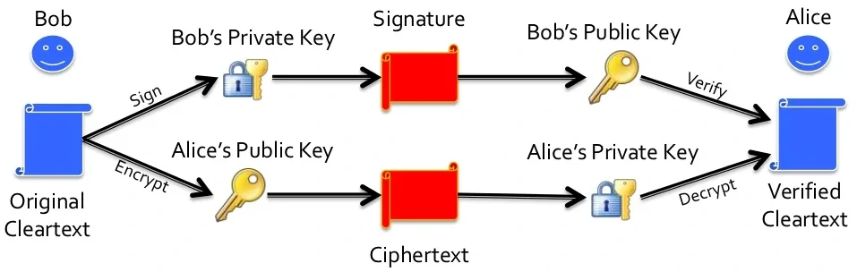

# SY110 Final Review

14OCT2022

---

### DISCLAIMER
- I do *not* know what is on the exam
- This review does not cover *every single topic/concept* from the semester
- DYOR

---

## Computer Components

- **Central Processing Unit (CPU)** - the brain of the computer; executes instructions and controls data flow to and from other parts of the computer
- **Random Access Memory (RAM)** - short-term memory; when you open a program it gets loaded into RAM; if the computer is shutdown, the contents in RAM are lost
- **Hard Drive (HDD)** - long-term memory; contents remain after the computer is shutdown
- **Peripherals** - components attached to the computer to increase capabilities; e.g. keyboard, mouse, monitor, webcam, printer, scanner, etc.

<!-- footer: '[Lecture 2](https://www.usna.edu/CyberDept/sy110/calendar.php?type=class&event=2)' -->

---

## Fetch, Decode, Execute of CPU

CPU performs the same steps over and over:
- **Fetch** the next instruction from as a block of bytes
- **Decode** the bytes to determine what action the instruction specifies
- **Execute** the action encoded in the instruction

CPU performs these steps hundreds of millions of times per second.

<!-- footer: '[Lecture 2](https://www.usna.edu/CyberDept/sy110/calendar.php?type=class&event=2)' -->

---

## President's 60-Day Cyberspace Policy Review

In May of 2009, President Obama directed a 60-Day Cyberspace Policy Review which among a variety of recommendations included an action item to "*expand and train the workforce, including ... cyber security expertise in the Federal government*"

In the fall semester of 2011, the Superintendent of the United States Naval Academy directed that an *Introduction to Cyber Security* course be added as part of the core curriculum for all Midshipmen to fulfill the action item from the *2009 60-Day Cyberspace Policy Review*


<!-- footer: '[Lecture 3](https://www.usna.edu/CyberDept/sy110/calendar.php?type=class&event=3)' -->

---

## Cyber Domain - Definition

- **Common**: "*the domain characterized by the 'human' use of electronics and the electromagnetic spectrum to store, modify, and exchange data via networked systems and associated physical infrastructures*"
- **DoD (JP 3-12)**: "*a global domain within the information environment consisting of the interdependent networks of information technology infrastructures and resident data, including the Internet, telecommunications networks, computer systems, and embedded processors and controllers*"

<!-- footer: '[Lecture 3](https://www.usna.edu/CyberDept/sy110/calendar.php?type=class&event=3)' -->

---

## Major Cyber Security Incidents

- **Operation Rolling Tide**: Navy's first offically named Cyber Operation in response to Iranian intrusion into an unclassified Navy network
- **Office of Personel Management (OPM) Hack**: breach and data theft that affected an estimated 22 million government employees; most only had their security clearance file information stolen, but an estimated 4 million also had SSNs, addresses, fingerprints, performance evaluations, and job assignment information stolen; officials suspected Chinese hackers based on investigations
- **Democratic National Committee (DNC)**: DNC staff targeted by spear-phishing emails in 2016; one successful spear-phising email allowed hackers to steal over 50,000 emails; Russian intelligence and hacking group named *Internet Research Agency*

<!-- footer: '[Lecture 3](https://www.usna.edu/CyberDept/sy110/calendar.php?type=class&event=3)' -->

---

## Major Cyber Security Incidents (con't)

- **Petya and Notpeyta**: malware that affected MS Windows computers in 2016 and 2017
    - Petya - ransomware that requires victim to pay ransome to regain access to their data
    - Notpetya - similar to Petya, but only exists to prevent users from accessing their data with no hope of recovering the data
- **Black Energy**: used to Ukrainian power distribution centers offline in 2015 for 6 hours; not an extremely costly attacked, but demonstrated the capability
- **Equifax Hack**: in 2017 hackers used known vulnerability to exploit an unpatched system at Equifax to steal the personal data of 143 million people; brought attention to private sector's responsiblity to protect consumer data

<!-- footer: '[Lecture 3](https://www.usna.edu/CyberDept/sy110/calendar.php?type=class&event=3)' -->

---

## Major Cyber Security Incidents (con't)

- **Solarwinds Hack**: in 2020, hackers inserted malicious code into Solarwinds software; when Solarwinds sent out the software updates to 33,000 customers the malicious code created backdoors allow hackers to access customer systems including the National Nuclear Security Administration
- **Colonial Pipeline Hack**: in 2021, the *Darkside* hacking group was suspected of launching a ransomware attack against the energy distribution company *Colonial Pipeline*; disruption caused increased gas prices and fears of critical infrastructure security problems

<!-- footer: '[Lecture 3](https://www.usna.edu/CyberDept/sy110/calendar.php?type=class&event=3)' -->

---

## Cyber Warfare

- **Cyber Battlefield**: digital data, the physical computer, operating systems, and programs; and continuing with the Web, the Internet, and both wired and wireless networks
- **Cyber Security Tools**: firewalls, encryption, hashing, policies and procedures — we combine in different ways to meet different security goals
- **Cyber Operations**: digital forensics, cyber reconnaissance, cyber attack, and cyber defense

<!-- footer: '[Lecture 4](https://www.usna.edu/CyberDept/sy110/calendar.php?type=class&event=4)' -->

---

## Aspects of the Cyber Domain

- **Persona**: users that have a role (persona) in the cyber domain; single person may have multiple personas in the cyber domain
- **Interface**: hardware and software that users interact with to provide input into other components in the cyber domain
- **Data**: the information stored with in systems
- **Network**: the paths that data flow across between systems or systems that store the data
- **Geographic**: the physical location of the user, system, or data paths; include natural boundaries and geopolitical boundaries

<!-- footer: '[Lecture 4](https://www.usna.edu/CyberDept/sy110/calendar.php?type=class&event=4)' -->

---

## Pillars of the Cyber Domain

- **Confidentiality**: protection of information from disclosure to unauthorized individuals, systems, or entities; confidentiality is **data** oriented
- **Integrity**: protection of information, systems, and services from unauthorized modification or destruction; integrity is **data** oriented
- **Availability**: timely, reliable access to data and information services by authorized users; availability is **service** oriented
- **Non-repudiation**: the ability to correlate, with high certainty, a recorded action with its originating individual or entity; non-repudiation is **entity** oriented
- **Authentication**: the ability to verify the identity of an individual or entity; authentication is **entity** oriented

<!-- footer: '[Lecture 4](https://www.usna.edu/CyberDept/sy110/calendar.php?type=class&event=4)' -->

---

## Pillars of the Cyber Domain - Examples

- **Confidentiality**: in 2021, the personal data of 533 million Facebook users from 106 countries was posted online for free in a low-level hacking forum
- **Integrity**: in 2010, the [Stuxnet](https://www.csoonline.com/article/3218104/what-is-stuxnet-who-created-it-and-how-does-it-work.html) computer worm was used to infiltrate and modify the computer systems controlling Iran's nuclear enrichment centrifuges and caused the centrifuges to spin out of control while giving the operators dispaly of normal indications
- **Availability**: in 2020 and 2021, several hospitals reported they were unable to use their systems due to what is called a Distributed Denial of Service Attack (DDOS)

<!-- footer: '[Lecture 4](https://www.usna.edu/CyberDept/sy110/calendar.php?type=class&event=4)' -->

---

## Pillars of the Cyber Domain - Examples (con't)

- **Non-repudiation**:
    - unauthorized manipulation of administrator access logs on any computer (making it hard or impossible to later prove who was logged on, and when)
    - unauthorized manipulation of e-commerce transaction logs (making it hard or impossible to later prove a company performed an action, such as an equipment purchase or a stock market trade)
- **Authentication**: in the spring of 2021, hackers breached the networks of Colonial Pipeline Co. because of a compromised password, which led to shortages of gas all across the East Coast

<!-- footer: '[Lecture 4](https://www.usna.edu/CyberDept/sy110/calendar.php?type=class&event=4)' -->

---

## Bits, Bytes, and Files

Digital data consists soley of 0's and 1's

- **Bit**: an individual 0 or 1 value
- **Byte**: a chunk of 8 bits (e.g 0100 1110)
- **File**: a sequence of bytes

<!-- footer: '[Lecture 5](https://www.usna.edu/CyberDept/sy110/calendar.php?type=class&event=5)' -->

---

## Number of Bytes

| Prefix | # of Bytes (Base 2) |  # of Bytes (Base 10) |
| ------ | :-----------------: | --------------------: |
| kilo   |        2^10         |                 1,024 |
| mega   |        2^20         |             1,048,576 |
| giga   |        2^30         |         1,073,741,824 |
| tera   |        2^40         |     1,099,511,627,776 |
| peta   |        2^50         | 1,125,899,906,842,624 |


<!-- footer: '[Lecture 5](https://www.usna.edu/CyberDept/sy110/calendar.php?type=class&event=5)' -->

---

## Number Systems

- [Intro to Number Systems - Khan Academy](https://youtu.be/ku4KOFQ-bB4)
- [Hexidecimal - Khan Academy](https://youtu.be/ku4KOFQ-bB4)
- [Decimal -> Binary - Khan Academy](https://youtu.be/H4BstqvgBow)
- [Decimal -> Binary (larger) - Khan Academy](https://youtu.be/NFmDz1dQyPU)
- [Decimal -> Hexidecimal - Khan Academy](https://youtu.be/NFmDz1dQyPU)
- [Binary -> Hexidecimal - Khan Academy](https://youtu.be/8T4F7WboWPQ)

<!-- footer: '[Lecture 5](https://www.usna.edu/CyberDept/sy110/calendar.php?type=class&event=5)' -->

---


<!-- footer: '[Lecture 5](https://www.usna.edu/CyberDept/sy110/calendar.php?type=class&event=5)' -->

---

## ASCII Encoding and Text

The method for representing text digitally (i.e. as bits and bytes) depends on the alphabet the text uses,

In ASCII, basic text is represented using one byte (i.e. one number in the range 0-255, although in reality we only use 0-127) for each character

<br />

> Encoding is converting data from one system of communication into another. There are other encoding schemes beyond ASCII; for example: base64, Unicode, UTF-8.

<!-- footer: '[Lecture 5](https://www.usna.edu/CyberDept/sy110/calendar.php?type=class&event=5)' -->

---


<!-- footer: '[Lecture 5](https://www.usna.edu/CyberDept/sy110/calendar.php?type=class&event=5)' -->

---

## Files

- **file**: a file on a computer is simply a sequence of bytes
- **file format**: the rules that define how the bytes of a particular file are supposed to be interpreted (e.g. JPEG files, PDF files, PowerPoint presentations, etc)
- **file extension**: the last part of the filename (e.g. .pdf, .jpg, .pptx) that operating systems (MS Windows) and programs use to tell them the file type; however, the extension does not reliably tell you the file type
- **file header**: a short sequence of data the head, or beginning, of the actual file data; viewing files in a HEX editor like frhed allows you to see the bytes of the file in HEX
- **GIFAR file**: a single file (sequence of bytes) that satisfies the formatting rules both for an image format and for an "archive" format; a file that is a valid `.jpg` image and a valid Java `.jar` file


<!-- footer: '[Lecture 5](https://www.usna.edu/CyberDept/sy110/calendar.php?type=class&event=5)' -->

---


<!-- footer: '[Lecture 5](https://www.usna.edu/CyberDept/sy110/calendar.php?type=class&event=5)' -->

---

## Policy and Law - Definitions

- **Policy**: outlines what a government hopes to achieve as well as the methods and principles it will use to achieve them. In other words, it's "***the set of actions the government should take in order to reach its desired outcome***"
- **Law**: "***the constitutional, statutory, and regulatory authorities set for accomplishing the goals of a policy, as well as limiting or constraining what the goal can be or how the policy can achieve the goal***". Laws are the standards, procedures, and principles that must be followed by those whom they apply to

<!-- footer: '[Lecture 6](https://www.usna.edu/CyberDept/sy110/calendar.php?type=class&event=6)' -->

---

## Anti-Hacking Laws

- **Computer Fraud and Abuse Act (CFAA)**: the primary federal anti-hacking law. The federal government can bring criminal actions against people who violate the CFAA, and victims of computer hacking can sue the attackers
- **Digital Millennium Copyright Act (DMCA)**: a 1998 amendment to the Copyright Act of 1976 which was intended to protect copyrighted works

<!-- footer: '[Lecture 6](https://www.usna.edu/CyberDept/sy110/calendar.php?type=class&event=6)' -->

---

## Private Sector Data Security Regulations

- **State and Federal**: private sector data security is regulated by a wide range of state and federal laws in the U.S
- **Section 5 of the FTC Act**: prohibits unfair and deceptive trade practices. The FTC has interpreted this to mean poor or misrepresented data security, and has brought enforcement actions against companies after data breaches
- **State Data Breach Notification Laws**: Every state requires companies to notify individuals and/or state regulators of a data breach. These laws all differ as to the type of information that triggers the obligation as well as the particular type of notification the companies must issue

<!-- footer: '[Lecture 6](https://www.usna.edu/CyberDept/sy110/calendar.php?type=class&event=6)' -->

---

## Posse Comitatus

The Posse Comitatus Act prohibits the use of the military to enforce domestic civilian laws absent an exception created by Congress.

This does not mean that the military can’t provide assistance in defending networks. It just can’t act as the police in arresting/assisting the prosecution.

<!-- footer: '[Lecture 6](https://www.usna.edu/CyberDept/sy110/calendar.php?type=class&event=6)' -->

---

## Section 230

Section 230 is in reference to Article 47 of the U.S. Code Section 230, which is part of the Communications Decency Act.

Section 230 states "No provider or user of an interactive computer service shall be treated as the publisher or speaker of any information provided by another information content provider" (47 U.S.C. S230).

In other words, any interactive computer service (specifically broad- and debated today) cannot be held responsible for what third parties do, post, use, etc using their internet services.

<!-- footer: '[Lecture 6](https://www.usna.edu/CyberDept/sy110/calendar.php?type=class&event=6)' -->

---

## Agencies Responsible for Cyber Security

- **Department of Defense (DoD)**
- **Department of Homeland Security (DHS)**: responsible for cybersecurity of civilian federal networks, systems, and information, protecting critical infrastructure, and assisting with cybersecurity of the US private sector
- **Department of Justice (DoJ)**: responsible for investigating, attributing, disrupting, and prosecuting violations of federal computer crime laws
- **Office of the National Cyber Director**: serves as a principal advisor to the President on cybersecurity policy and strategy, and cybersecurity engagement with industry and international stakeholders
- **Cybersecurity and Infrastructure Agency (CISA)**:  leads the national effort to understand, manage, and reduce risk to our cyber and physical infrastructure

<!-- footer: '[Lecture 6](https://www.usna.edu/CyberDept/sy110/calendar.php?type=class&event=6)' -->

---

## NIST Cybersecurity Framework 

NIST is a non-regulatory agency of the U.S. Department of Commerce whose mission is to promote innovation and industrial competitiveness. [Lecture 6](https://www.usna.edu/CyberDept/sy110/calendar.php?type=class&event=6)

- **Identify**: develop an organizational understanding to manage cyber-security risk to systems, people, assets, data, and capabilities
- **Protect**: develop and implement appropriate safeguards to ensure delivery of critical services
- **Detect**: develop and implement appropriate activities to identify the occurrence of a cyber-security event
- **Respond**: develop and implement appropriate activities to take action regarding a detected cyber-security incident
- **Recover**: develop and implement appropriate activities to maintain plans for resilience and to restore any capabilities or services that were impaired due to a cybersecurity incident

<!-- footer: '[Lecture 6](https://www.usna.edu/CyberDept/sy110/calendar.php?type=class&event=6)' -->

---

## DoD Cyber Objectives

1. Ensuring the Joint Force can achieve its missions in a contested cyberspace environment.
2. Strengthening the Joint Force by conducting cyberspace operations that enhance U.S. military advantages
3. Defending U.S. critical infrastructure from malicious cyber activity that alone, or as part of a campaign, could cause a significant cyber incident.
4. Securing DoD information and systems against malicious cyber activity, including DoD information on non-DoD-owned networks.
5. Expanding DoD cyber cooperation with inter-agency, industry, and international partners.

<!-- footer: '[Lecture 6](https://www.usna.edu/CyberDept/sy110/calendar.php?type=class&event=6)' -->

---

## DoD Cyber Strategic Goals

1. Build a more lethal Joint Force.
2. Compete and Deter in Cyberspace.
3. Strengthen alliances and attract new partnerships.
4. Reform the Department.
5. Cultivate talent.

<!-- footer: '[Lecture 6](https://www.usna.edu/CyberDept/sy110/calendar.php?type=class&event=6)' -->

---

## Risks and Vulnerabilities - Terminology

- **risk**: a measure of the extent to which an entity is threatened by a potential circumstance or event
- **impact**: an adverse effect that results from an event occurring
- **vulnerabiltiy**:
    - a weakness in a system that can be exploited by a threat that adversely affects the system, results in an adverse impact. [general context]
    - a weakness in an information system that can be exploited to compromise a pillar of cyber security. [cyber domain context]

<!-- footer: '[Lecture 7](https://www.usna.edu/CyberDept/sy110/calendar.php?type=class&event=7)' -->

---

## Risks and Vulnerabilities - Terminology (con't)

- **threat**: an actor or event with the potential to adversely impact an information system
- **capability**: the knowledge and skill set required by a threat to carry out an event
- **opportunity**: the resources and positioning required by a threat to carry out an action
- **intent**: the motivation of a threat to carry out an action

<!-- footer: '[Lecture 7](https://www.usna.edu/CyberDept/sy110/calendar.php?type=class&event=7)' -->

---

## Risk Management Tradeoff

For each service one needs to weigh the value of the service against the security implications of providing/allowing it. We weigh the risk against the functionality (benefits) and cost to make a decision on how to proceed.


<!-- footer: '[Lecture 7](https://www.usna.edu/CyberDept/sy110/calendar.php?type=class&event=7)' -->

---

## Risk Factors


<!-- footer: '[Lecture 7](https://www.usna.edu/CyberDept/sy110/calendar.php?type=class&event=7)' -->

---

## Likelhood - Vulnerability Component

- **Discoverable**: How easy is it for an adversary to discover the vulnerability?
- **Exploitable**: How easy is it for an adversary to exploit the vulnerability?
- **Awareness**: How well known is the vulnerability?
- **Detectable**: How likely is an exploit to be detected?

## Likelhood - Threat Component

- **Capability**: How technically skilled is an adversary?
- **Capability**: How much does the adversary know about the target system?
- **Opportunity**: Does the adversary have the resources (technology) to exploit a vulnerability?
- **Opportunity**: Is the adversary in a position to exploit a vulnerability?
- **Intent**: How motivated is an adversary to find and exploit a vulnerability?
- **Intent**: Does the actor performing the exploit intend harm?

<!-- footer: '[Lecture 7](https://www.usna.edu/CyberDept/sy110/calendar.php?type=class&event=7)' -->

---

# Impact

*Technical* impacts are associated with the Pillars of Cyber Security. For example, if the password file for a web based service is compromised, the Authentication pillar is impacted.

*Non-Technical* impacts are associated with the operations and relationships of an organization:
- **Personnel**: To what extent are personnel put in physical danger if the vulnerability is exploited?
- **Equipment**: To what extent is equipment put in physical danger if the vulnerability is exploited?
- **Operations**: To what extent will the success of operations be endangered?
- **Capabilities**: To what extent will the capabilities of the organization be damaged?
- **Reputation**: To what extent will the organization's reputation be damaged?
- **Financial**: What will the financial damage to the organization be?

<!-- footer: '[Lecture 7](https://www.usna.edu/CyberDept/sy110/calendar.php?type=class&event=7)' -->

---

## Risk Management Process


<!-- footer: '[Lecture 7](https://www.usna.edu/CyberDept/sy110/calendar.php?type=class&event=7)' -->

---

## Addressing Risk

- **Avoid** - Avoid activities that would make you incur the risk
- **Control** - Apply measures to reduce (mitigate) the risk
- **Accept** - Accept all of the risk and continue the activity
- **Transfer** - Transfer the risk to someone else

It is impossible to nullify risk; there is risk in any action. Any risk that remains after a strategy has been applied is known as ***residual risk***.

<!-- footer: '[Lecture 7](https://www.usna.edu/CyberDept/sy110/calendar.php?type=class&event=7)' -->

---

## Operating Systems

An Operating System (OS) is a program (or collection of programs) that manages the physical computer and the programs that run on it (programs managing programs).

Examples of Operating Systems:
- Microsoft Windows
- UNIX
- iOS
- Android

---

## OS Functions

- **File Operations**: the OS manages all the different storage peripherals. The OS can create, modify, read and destroy files on behalf of other Programs
- **Network Connections**: the OS can actually send or receive data to/from a computer's wired or wireless connection
- **User Accounts, Permissions, and Logins**: the OS ensures that users log in properly and can only access the things they're supposed to
- **Processes**: the OS manages the Programs as they execute
- **The Grahical User Interface (GUI)**: the stuff you click on or use your fingers on a touch screen to interact with
- **The Shell**: shell allows commands for the OS to be entered as plain text strings. The shell is an OS interface for both Programs and users.
- **The Application Programming Interface (API)**: direct way for a Program to ask the OS to do something. The API is an interface exclusively for Programs


<!-- footer: '[Lecture 8](https://www.usna.edu/CyberDept/sy110/calendar.php?type=class&event=8)' -->

---

## File Systems


<!-- footer: '[Lecture 8](https://www.usna.edu/CyberDept/sy110/calendar.php?type=class&event=8)' -->

---

## Shell Command Structure


- **command name**: a shell command is a request to have a Program executed, and name is literally the name of the Program you want executed
- **command options**: special arguments that start with a / or - character in Windows (with a - character in UNIX), they modify the operation of the given command
- **command arguments**: provide the command with the information it needs to operate

<!-- footer: '[Lecture 9](https://www.usna.edu/CyberDept/sy110/calendar.php?type=class&event=9)' -->

---

## Windows/Unix Commands and Tools

Be familiar with the name and use of [Windows and Linux commands](https://www.usna.edu/CyberDept/sy110/calendar.php?key=3a50af6a3f71ddff08be91e84d7f272573dbc4b1&type=resources&event=1)

Be familiar with the name and use of [Basic Networking Tools](https://www.usna.edu/CyberDept/sy110/calendar.php?key=3a50af6a3f71ddff08be91e84d7f272573dbc4b1&type=resources&event=1)

<!-- footer: '[Lecture 9](https://www.usna.edu/CyberDept/sy110/calendar.php?type=class&event=9)' -->

---

## Processes

Recall that a *Program* is really just a file, a file that contains the instructions the CPU is supposed to execute.

A running instance of a Program is called a ***process***.

A process contains a copy of the executable bytes (copied from the hard drive, in a .exe file), as well as some bookkeeping information that allows the OS to monitor the process execution status, resources, and privileges.

<!-- footer: '[Lecture 9](https://www.usna.edu/CyberDept/sy110/calendar.php?type=class&event=9)' -->

---

## World Wide Web

The "World Wide Web" is the vast global collection of *servers* and *clients* (aka browsers) communicating over the Internet using the HTTP or HTTPS *protocols*.
- **server**: a computer (and associated programs) that provides a service
- **client**: a computer (or program) that uses a service provided by a server
- **protocol**: an agreement about communication between two communicating parties -- a complete specification of what things can be said, what responses can and must be made, and what these things mean

<!-- footer: '[Lecture 10](https://www.usna.edu/CyberDept/sy110/calendar.php?type=class&event=10)' -->

---

## The Web and The Internet

- **website**: a collection of one or more files that contain the content you see displayed when you visit a website with your browser. These files include the main webpage, but also image files, script files (that make the webpage do things), and other files.
- **web server**: Web servers are computers (and the software running on them) that exist to supply website content, using the HTTP or HTTPS protocol, on demand
- **web client** = Browser: For a user, and for this course, a web client is just a browser, such as Chrome, Firefox, IE, or Opera.

"Web" vs. "Internet"
- Web — web servers, web clients. HTTP and HTTPS protocols.
- Internet — includes web, but also includes e-mail, streaming media, VOIP, chat, internet gaming, etc., plus all the communications hardware and protocols to connect them.

<!-- footer: '[Lecture 10](https://www.usna.edu/CyberDept/sy110/calendar.php?type=class&event=10)' -->

---

### URLs

Uniform Resource Locator (URL) - tells the browser where to find the item you want, and the name of the item.

```
http://www.usna.edu/Users/cs/wcbrown/index.html
\__/   \__________/\__________________________/
 |          |                 |
protocol    |         path on server's file system
         server
```

- **Protocol Part**: most browsers support several protocols, including `http` and `https` for client-server web traffic
- **Server Part (Domain Name)**: the server is specified by a domain name — something like `www.cnn.com` or `en.wikipedia.org`
- **File System Path Part**: The "content" of a web server can be thought of as a hierarchical structure of files, similar to a directory on a Windows or UNIX system. The path is a relative path from some point in the server's file system

<!-- footer: '[Lecture 10](https://www.usna.edu/CyberDept/sy110/calendar.php?type=class&event=10)' -->

---

## Client-Server Interaction

When you enter a URL like `https://intranet.usna.edu/MIDREGS/chapter_05/5.3_computer_use_and_regulations.php` in your browser's address bar, it initiates the following sequence of actions:
1. The browser contacts the server `intranet.usna.edu` (using the HTTPS protocol) and asks it to get the file `/MIDREGS/chapter_05/5.3_computer_use_and_regulations.php`.
2. The server retrieves the file `/MIDREGS/chapter_05/5.3_computer_use_and_regulations.php` and sends it (serves it) to the browser.
3. The browser receives the file from the server and renders it on screen in your browser window.

<!-- footer: '[Lecture 10](https://www.usna.edu/CyberDept/sy110/calendar.php?type=class&event=10)' -->

---

## Client-Server Interaction - Example


<!-- footer: '[Lecture 10](https://www.usna.edu/CyberDept/sy110/calendar.php?type=class&event=10)' -->

---

## Web Server Logs

From the earlier example of visiting `https://intranet.usna.edu/MIDREGS/chapter_05/5.3_computer_use_and_regulations.php`, there is a record of the transaction created on both the server and the client (browser):
- the server makes a record in a file called its *access log*. The record notes that you requested the file and the file was sent to you.
- the browser records that it visited the site (that's where your browser's *history* comes from), and it keeps a copy of the visited page in what's called a *cache*.

<!-- footer: '[Lecture 10](https://www.usna.edu/CyberDept/sy110/calendar.php?type=class&event=10)' -->

---

## Supply Chain and Supply Chain Risk

A **Supply Chain** is a distributed and interconnected web of people, processes, technology, information, and resources that create and deliver a product or service.

**Globalization** is the spread of the supply chain throughout the world.

**Supply Chain Risk** is the possibility an adversary may exploit a weakness or vulnerability to compromise one or more of the components of the supply chain.

Supply Chain Risk can manifest itself in both software and hardware.
- Software: compromised software with malware directly written into it or vendors using third party code or other software from unknown sources.
- Hardware: Counterfeit electronics, compromised or cloned parts, or incorrect packaging.


<!-- footer: '[Lecture 12](https://www.usna.edu/CyberDept/sy110/calendar.php?type=class&event=12)' -->

---

## Cyber Kill Chain

- **Reconnaissance**: planning and research of the system/supply chain that will be attacked including, but not limited to probing systems and visiting websites
- **Weaponization**: attacker has to craft a tool that they want to use to attack the intended target including denial of service or malware delivery
- **Delivery**: involves an attacker actually sending the malicious code or executing the attack. Methods can include phishing emails and spam.
- **Exploitation**: occurs once the delivered malware is downloaded on the host network or system in the supply chain.
- **Installation**: the attacker can further modify the malicious payload in order to maintain control.
- **Command and Control (C2)**: the attacker interacting more with the malicious payload. The attacker may establish backup connections or deliver new malware.
- **Actions on Objectives**: actually doing the damage that the attack is intended to do

<!-- footer: '[Lecture 12](https://www.usna.edu/CyberDept/sy110/calendar.php?type=class&event=12)' -->

---

## Defeating the Cyber Kill Chain

- **Reconnaissance**: Be watchful for methods of reconnaissance on your systems.
- **Weaponization**: Identify vulnerabilities in your systems or on your machines.
- **Delivery/Exploitation/Installation**: Training personnel about cyber hygiene, updating spam filters, or having up to date anti-virus software.
- **Command and Control (C2)/Actions and Objectives**: Applying access control features, monitoring traffic, and having multiple layers of defense.

<!-- footer: '[Lecture 12](https://www.usna.edu/CyberDept/sy110/calendar.php?type=class&event=12)' -->

---

## JavaScript - Variables

Create a variable named `x`: `var x;`
Assign a value to a variable named `x`: `x = 4;`
Create a variable `y` and assign value at the same time: `var y = 2026;`
Strings can be assigned to variables: `var s = "Three more days!"`
<br />
> remember that `=` is assignment, not equality

<!-- footer: '[Lecture 14](https://www.usna.edu/CyberDept/sy110/calendar.php?type=class&event=14)' -->

---

## JavaScript - Loops

Loops allow a simple program to execute the same code repetitively until a certain condition is met, enabling a short program to do a lot of work.

```js
var total = 0; // Create variable and assign value
var k = 1;

while(k <= 10) // control variable 'k'; continuation condition 'k <= 10'>
    // everything between the '{ }' gets executed for every loop iteration
    {
        total = total + k;
        k = k + 1;
    }

alert("total = " + String(total)); // this line executes after the loop is done
```

<!-- footer: '[Lecture 14](https://www.usna.edu/CyberDept/sy110/calendar.php?type=class&event=14)' -->

---

## JavaScript - Conditionals

Conditional statements allow different parts of a program (i.e., different lines of code) to execute depending on whether or not certain conditions are met.

```js
var input = prompt("Enter a number between 1-100."); // get input from user
var n = Number(input); // convert string input into a number

// check condition `n <= 50`
if(n <= 50) {
    // This code is run if the condition is true
    alert("Your number was less than or equal to 50.");
    }

else {
    // This code is run if the condition is false
    alert("Your number was greater than 50.");
    }
```

<!-- footer: '[Lecture 14](https://www.usna.edu/CyberDept/sy110/calendar.php?type=class&event=14)' -->

---

## JavaScript - Comparison Symbols

- `>` - greater than
- `>=` - greater than or equal to
- `<` - less than
- `<=` - less than or equal to
- `==` - equal to
- `!=` - not equal to

<!-- footer: '[Lecture 14](https://www.usna.edu/CyberDept/sy110/calendar.php?type=class&event=14)' -->

---

## Dynamic Web Pages

- **static**: nothing on the page changes (much like the pages you built this semester); every user sees the same thing
- **dynamic**: changes occur to the current page, with our without user interaction, or that websites have pages that look different for different users
- **script**: snippet of code that can execute on the client machine (browser) or the web server to produce dynamic content; scripts can be event driven (the user does something) or non-event driven

<!-- footer: '[Lecture 15](https://www.usna.edu/CyberDept/sy110/calendar.php?type=class&event=15)' -->

---

## Client-Side vs Server-Side

- Allowing code to execute could pose a security risk.
    - client-side: the client incurs the risk as it is running on their machine
    - server-side: the server incurs the risk as the script is running on the server machine
- Communication
    - client-side: require the initial communication to GET the web page HTML file. No additional communication with the server is required.
    - server-side: there is additional back and forth communication as your web browser tells the server to execute the script and the server then replies back with the web page changed by the result of running the script
- Executing scripts costs CPU cycles. Server-side scripts cause more work for the server machine, client-side scripts cause more work for the client-side machine.

<!-- footer: '[Lecture 15](https://www.usna.edu/CyberDept/sy110/calendar.php?type=class&event=15)' -->

---

## Embedded Script in Web Page

```html
<html>
  <head></head>
  <body>
    <script type="text/javascript"> // HTML element for embedded script
      var iter = 0;
      while(iter < 1000)
        {
          iter = iter + 1;
          document.write("G O N A V Y ! "); // adds content to the web page   
        }
    </script>
  </body>
</html>
```

<!-- footer: '[Lecture 15](https://www.usna.edu/CyberDept/sy110/calendar.php?type=class&event=15)' -->

---

## Selecting Items on the Page

Given the following element in HTML code for a web page:

```html
<p id="foo">Element id is foo</p>
```

To select that element and assign it to a variable in JavaScript:

```js
var paragraph = document.getElementById("foo");
```

<!-- footer: '[Lecture 15](https://www.usna.edu/CyberDept/sy110/calendar.php?type=class&event=15)' -->

---

## Modifying Elements

After selecting an element to update, the following are examples of what can be modified with JavaScript:

- `.innerHTML`: stores whatever is between the start and end tags of the element as a string 
- `.style.color`: stores the color of the text
- `.style.background`: stores the background color
- `.style.fontFamily`: stores the font "family"
- `.style.fontSize`: stores the size of the font

<!-- footer: '[Lecture 15](https://www.usna.edu/CyberDept/sy110/calendar.php?type=class&event=15)' -->

---

## Modifying Elements Example

Given the original paragraph element:
```html
<p id="foo">Element id is foo</p>
```

And the following JavaScript:
```js
var paragraph = document.getElementById("foo");
paragraph.innerHTML = "Updated paragraph element";
```

The updated paragraph element:
```html
<p id="foo">Updated paragraph element</p>
```

<!-- footer: '[Lecture 15](https://www.usna.edu/CyberDept/sy110/calendar.php?type=class&event=15)' -->

---

## Event Driven Changes

Most 'events' are mouse related, we can use those events to trigger changes:

```html
Clicking anywhere
<b onclick='document.body.style.color="#ff0000"'>within the bold text</b>
causes the text to go red!
```

Other events:
- **onclick**: script to be run on a mouse click
- **ondblclick**: script to be run on a mouse double-click
- **onmousedown**: script to be run when mouse button is pressed
- **onmousemove**: script to be run when mouse pointer moves
- **onmouseout**: script to be run when mouse pointer moves out of an element
- **onmouseover**: script to be run when mouse pointer moves over an element
- **onmouseup**: script to be run when mouse button is released


<!-- footer: '[Lecture 15](https://www.usna.edu/CyberDept/sy110/calendar.php?type=class&event=15)' -->

---

## Forms

HTML Forms allow us to place multiple input boxes, buttons, sliders etc. all in the same page to provide user input and output:

```html
<form name="buttonForm" onsubmit="return false;">
  <input type="text" name="x" value="2">
  <input type="button" value="Square It"
    onclick="var t = document.forms.buttonForm.x.value;
             document.forms.buttonForm.x.value = t * t;">
</form>
```


<!-- footer: '[Lecture 15](https://www.usna.edu/CyberDept/sy110/calendar.php?type=class&event=15)' -->

---

## Client-Side vs Server-Side Forms

Client-Side:
```html
<form name="clientSide" onsubmit="return false;">
  <input type="text" name="fahrenheit"> &#176;F
  <input type="button" value="Convert" 
        onclick="var f = document.forms.clientSide.fahrenheit.value;
                 var c = 5/9*(f - 32);
                 document.body.innerHTML = c + ' &#176;C';"
  >
</form>
```
Server-Side:
```html
<form name="serverSide"
      action="http://courses.cyber.usna.edu/SY110/f2c.jsx" 
      method="get">
  <input type="text" name="fahrenheit"> &#176;F
  <input type="button" onclick="submit();" value="Convert">
</form>
```

<!-- footer: '[Lecture 15](https://www.usna.edu/CyberDept/sy110/calendar.php?type=class&event=15)' -->

---

## How Server-Side Forms Work

Server-Side:
```html
<form name="serverSide"
      action="http://courses.cyber.usna.edu/SY110/f2c.jsx" 
      method="get">
  <input type="text" name="fahrenheit"> &#176;F
  <input type="button" onclick="submit();" value="Convert">
</form>
```

```
  http://courses.cyber.usna.edu/SY110/f2c.jsx?fahrenheit=78.3
         \__________________________________/ \________/ \__/
          from the FORM's "action" attribute    INPUT     INPUT
                                                element's element's
                                                name      value
```

<!-- footer: '[Lecture 15](https://www.usna.edu/CyberDept/sy110/calendar.php?type=class&event=15)' -->

---

## Malware

Malware is *malicious software* — that is to say programs that violate one or more of the Five Pillars of Cyber Security.

Types of malware:
- **virus**: program that with user action can replicate itself and "infect" a computer.
- **worm**: self-replicating, self-propagating program that uses networking mechanisms to spread itself
- **trojan**: program that appears to have a useful function, but also has a hidden and potentially malicious function that evades security mechanisms
- **ransomware**: delivered by virus, worm, or trojan; encrypts users files and demands payment to unlock

<!-- footer: '[Lecture 16](https://www.usna.edu/CyberDept/sy110/calendar.php?type=class&event=16)' -->

---

## Malware Preventention/Detection/Recovery

Review the Prevention/Detection/Recovery section of [Lecture 16](https://www.usna.edu/CyberDept/sy110/calendar.php?type=class&event=16)

<!-- footer: '[Lecture 16](https://www.usna.edu/CyberDept/sy110/calendar.php?type=class&event=16)' -->

---

## Networking

- **Network**: collection of interconnected computers, such that the computers can pass messages between each other
- **Host**: a computer connected to a network
- **Protocol**: an agreement about communication between two communicating parties — a complete specification of what things can be said, what responses can and must be made, and what these things mean (e.g. HTTP)
- **Service**: provide end user functionality use of protocols (e.g. web server)
- **Utilities**: standard tools for accessing protocols/services (e.g. curl)


<!-- footer: '[Lecture 17](https://www.usna.edu/CyberDept/sy110/calendar.php?type=class&event=17)' -->

---


<!-- footer: '[Lecture 17](https://www.usna.edu/CyberDept/sy110/calendar.php?type=class&event=17)' -->

---
<style scoped>
    section {
        font-size: 1.15em;
    }
</style>
| Layer       | Function                                                             |             Protocol             |        Unit         |                 Address                  |  Hardware  | Command                       |
| ----------- | -------------------------------------------------------------------- | :------------------------------: | :-----------------: | :--------------------------------------: | :--------: | ----------------------------- |
| Application | Provide end user services                                            |    HTTP/HTTPS, DNS, SSH, DHCP    |        data         |                   N/A                    |    N/A     | `tasklist`, `nslookup`        |
| Transport   | Connects process on one host to process on another host              |             TCP/UDP              | datagram OR segment | port http(80) https(443) DNS(53) ssh(22) |    N/A     | `netstat`                     |
| Network     | Connects different local networks to each other                      |            IPv4, IPv6            |       packet        |          IP address 192.168.1.1          |   router   | `netstat`, `ipconfig`, `ping` |
| Data Link   | Collection of computers that are directly connected                  | Ethernet,WiFi,Cellular(3G,4G,5G) |        frame        |      MAC address AA:BB:CC:DD:EE:FF       | switch/hub | `ipconfig`, `arp`             |
| Physical    | Transmitting and receiving digital data across a transmission medium |        Same as Data Link         |     bits/bytes      |                   N/A                    |    hub     | `ipconfig`                    |


<!-- footer: '[Lecture 17](https://www.usna.edu/CyberDept/sy110/calendar.php?type=class&event=17), [Lecture 18](https://www.usna.edu/CyberDept/sy110/calendar.php?type=class&event=18), [Lecture 19](https://www.usna.edu/CyberDept/sy110/calendar.php?type=class&event=19), [Lecture 20](https://www.usna.edu/CyberDept/sy110/calendar.php?type=class&event=20), [Lecture 21](https://www.usna.edu/CyberDept/sy110/calendar.php?type=class&event=21)' -->

---

## Wireless

- **station**: Anything with a radio that can play 802.11. Note that 802.11 radios have MAC addresses just like Ethernet cards
- **base station**: The base station acts like a hub in a wireless network. The other stations send any network traffic to it, which it then broadcasts out for all stations to receive. (WAP - Wireless Access Point - is more or less a synonym.) We will refer to the other stations on the network as host stations.
- **basic service set (BSS)**: A base station and the hosts stations that are communicating with/through it is called a BSS (Basic Service Set). The BSS can be uniquely identified by the MAC address of the base station (this is called the BSSID)
- **service set identifier (SSID)**: name of the wireless network for a single base station (e.g. your network at home)
- **extended service set identifier (ESSID)**: name of multiple base stations acting as a single network (e.g. `GNBA-N`)

<!-- footer: '[Lecture 22](https://www.usna.edu/CyberDept/sy110/calendar.php?type=class&event=22)' -->

---

## Wireless Security Standards

- **WEP (Wired Equivalent Privacy)**: the oldest of the three methods. This uses a weak (by today's standards) encryption method and a 40-bit key. There are free tools and instructions for how to listen in on a WEP-protected network and crack the password. This should not be your first choice of encryption, not even at home.
- **WPA (Wifi Protected Access)**: which uses the same encryption method as WEP, but uses a stronger 128-bit key. This is certainly stronger than WEP, but not an altogether new solution.
- **WPA2 (Wifi Protected Access 2)**: is the strongest of the three encryption methods. This uses a strong 256-bit key for the encryption and is currently considered the best protection for wireless networks.

<!-- footer: '[Lecture 22](https://www.usna.edu/CyberDept/sy110/calendar.php?type=class&event=22)' -->

---

## Network Security

- **firewall**: network security device that monitors incoming and outgoing network traffic and decides whether to allow or block specific traffic based on a defined set of security rules
- **intrusion detection system (IDS)**: system that monitors network traffic for suspicious activity and issues alerts when such activity is discovered
- **intrustion prevention system (IPS)**: syatem that examines network traffic flows to detect and prevent vulnerability exploits
- **email security**: product or service that is designed to prevent the transmission of emails that break company policy
- **network segmentation**: the act of splitting a network into many “sub networks” known as segments.
- **virtual private network (VPN)**: allow you to connect two or more private networks over a public network

<!-- footer: '[Lecture 23](https://www.usna.edu/CyberDept/sy110/calendar.php?type=class&event=23)' -->

---

## IDS vs IPS

| IDS                                                | IPS                                 |
| -------------------------------------------------- | ----------------------------------- |
| Detection mode only                                | Active traffic control              |
| Traffic replication required                       | "Original" traffic required         |
| Decoupling detection and reaction functions        | Detection and reaction support      |
| IDS as a good assistant for network administration | No administrator assistance needed  |
| Usually used for testing rules                     | Requires strict configuration       |
|                                                    | Two network cards bridging required |

<!-- footer: '[Lecture 23](https://www.usna.edu/CyberDept/sy110/calendar.php?type=class&event=23)' -->

---

## Firewall Rules

Allow DNS requests from internal network only to the DNS server at `8.8.8.8`.
Block all SSH from internal network to any server. 
| Protocol | Source     | Port | Destination | Port | Action |
| -------- | ---------- | ---- | ----------- | ---- | ------ |
| UDP      | 10.0.0.0/8 | Any  | 8.8.8.8     | 53   | Allow  |
| TCP      | 10.0.0.0/8 | Any  | Any         | 22   | Deny   |


<!-- footer: '[Lecture 23](https://www.usna.edu/CyberDept/sy110/calendar.php?type=class&event=23)' -->

---

## Human Factors

Security tool interfaces should be:
- **Understandable**: options and descriptions should be presented in a manner that is meaningful to the human user
- **Locatable**: users need to be able to find the security features they need
- **Visible**: the system should give a clear indication of whether security is being applied
- **Convenient**: the security provision should not become so prominent that it becomes inconvenient or intrusive to the user

<!-- footer: '[Lecture 24](https://www.usna.edu/CyberDept/sy110/calendar.php?type=class&event=24)' -->

---

## Hacking the Human Being

- **Phishing**: email that tricks user into opening email/attachment or clicking link
- **Spearphishing**: targeted form of phishing aimed at a single user
- **Reverse Social Engineering**: user comes to the attacker (e.g. domain squatting)
- **Automated Social Engineering**: using 'bots' to automate attacks
- **In Person Attacks**:
    - *Impersonation*: attacker spoofs the identity of someone else
    - *Tailgaiting*: follwing someone inside a door (e.g. *reciprocity* of holding door open)
    - *Shoulder surfing*: looking over the shoulder of victim (in person or via camera)
    - *Dumpster diving*: exactly what it sounds like
    - *Lock picking*: gaining access to physically locked spaces

<!-- footer: '[Lecture 24](https://www.usna.edu/CyberDept/sy110/calendar.php?type=class&event=24)' -->

---

## Why are Humans Vulnerable?

- **Strong Affect**: uses a heightened emotional state to enable a hacker to get away with more than what would be normally reasonable.
- **Overloading**: attacker uses an abundance of information to numb the victim, thereby overriding their critical thinking.
- **Reciprocation**: the social principle which says that we should return favors.
Deceptive Relationships – building a relationship with the purpose of exploiting the other person.
- **Diffusion of Responsibility and Moral Duty**: the target is made to feel that s/he will not be held solely responsible for her or his action.
- **Authority**: people are conditioned to respond to authority.
- **Integrity and Consistency**: people tend to follow through with their commitments, however unwisely made.

<!-- footer: '[Lecture 24](https://www.usna.edu/CyberDept/sy110/calendar.php?type=class&event=24)' -->

---
<style scoped>
    section {
        font-size: 1.25em;
    }
</style>

## Why are Humans Vulnerable? (con't)

- **Distraction Principle**: while we are distracted by what grabs our interest, hustlers can do anything to us and we won’t notice.
Social Compliance Principle**: society trains people to not question authority. Hustlers exploit this to make us do what they want.
- **Herd Principle**: we let our guards down when others around us share in our risks (i.e. safety in numbers).
- **Dishonesty Principle**: victims convinced they did something wrong originally which led to a security breach are less likely to report the breach.
- **Kindness Principle**: people are fundamentally nice and willing to help, an attribute hustlers take advantage of.
- **Need and Greed Principle**: our needs and desires make us vulnerable.
- **Social Compliance Principle**: society trains people to not question authority. Hustlers exploit this to make us do what they want.
- **Herd Principle**: we let our guards down when others around us share in our risks (i.e. safety in numbers).
- **Dishonesty Principle**: victims convinced they did something wrong originally which led to a security breach are less likely to report the breach.
- **Kindness Principle**: people are fundamentally nice and willing to help, an attribute hustlers take advantage of.
- **Need and Greed Principle**: our needs and desires make us vulnerable.
- **Time Principle**: when under pressure to make an important choice, we use a different decision strategy, and hustlers steer us toward one involving less reasoning.

<!-- footer: '[Lecture 24](https://www.usna.edu/CyberDept/sy110/calendar.php?type=class&event=24)' -->

---

## Cryptography

- **encryption**: the idea is to scramble a message in such a way that only the intended recipient of the message can unscramble it, so that only the two of you know the message. Encryption is used to help provide confidentiality. Encryption hides the contents of a message, but not the existence of a message.
- **hashing**: you create a number (called the hash) from a file or string using a process that can't be reversed. When a new file or string comes in, you hash it and compare it to the previous value. If the hashes are the same, you say the file or string is the same as the previous one. Hashing is used to help provide integrity.
- **steganography**: the goal is to hide the existence of the message. Steganography is used to help provide confidentiality. Stegonagraphy hides the existence of a message.


<!-- footer: '[Lecture 25](https://www.usna.edu/CyberDept/sy110/calendar.php?type=class&event=25)' -->

---

## Symmetric Encryption

- Single key used for encryption and decryption
- Challenge is sharing the key between the sender and the receiver...and keeping it SECRET
- Examples:
    - Caeser Shift
    - Vigenere
    - Advanced Encryption Standard (AES)


<!-- footer: '[Lecture 26](https://www.usna.edu/CyberDept/sy110/calendar.php?type=class&event=26)' -->

---

## Caesar Shift Cipher

'Key' is a number that is used to *rotate* the alphabet to encrypt/decrypt the message.

```
KEY: 13

PT: A B C D E F G H I J K L M N O P Q R S T U V W X Y Z
CT: N O P Q R S T U V W X Y Z A B C D E F G H I J K L M

PT: C Y B E R
CT: P L O R E
```


<!-- footer: '[Lecture 26](https://www.usna.edu/CyberDept/sy110/calendar.php?type=class&event=26)' -->

---

## Vigenere Cipher

```
KEY: CODE

 PT: C Y B E R C L A S S
KEY: C O D E C O D E C O
 CT: E M E I T Q O E U G
```

Repeat the letters of the 'key' to cover the message letters.

Match 'Plaintext' letter with 'Key' letter to get 'Ciphertext' letter.

In general, longer key == more secure.


<!-- footer: '[Lecture 26](https://www.usna.edu/CyberDept/sy110/calendar.php?type=class&event=26)' -->

---

## Asymmetric Encryption (Public-Key Cryptography)

Sender and receiver (i.e. Alice and Bob) have *two* keys of their own:
    - *public key*: shared with the world
    - *private key*: owner keeps as a closely guarded secret

Important points:
- A message may be encrypted with a private key and then decrypted with the corresponding (paired) public key, OR it can be encrypted with a public key and then decrypted with the corresponding private key. Either key may be used for encryption or decryption
- A message encrypted with a certain public key can ONLY be correctly decrypted with the corresponding private key, and vice versa.
- Because only the private key needs to be protected, public keys can be shared openly (even to Eve), and therefore the *limitation of symmetric encryption is alleviated*.


<!-- footer: '[Lecture 27](https://www.usna.edu/CyberDept/sy110/calendar.php?type=class&event=27)' -->

---

## Asymmetric Encryption - Example

Alice uses Bob's **public key** to **encrypt** the message.

Bob uses *his* **private key** to **decrypt** the message.

Since Bob is the only one with his private key, he is the only person that can decrypt messages that are encrypted with his public key.

<br /><br />


<!-- footer: '[Lecture 27](https://www.usna.edu/CyberDept/sy110/calendar.php?type=class&event=27)' -->

---

## Asymmetric Encryption - Signing Example

Alice uses *her* **private key** to **sign** the message.

Bob uses *Alice's* **public key** to **verify** the signature.

Since Alice is the only one with her private key, Bob is assured that Alice sent the message.

<br /><br />


<!-- footer: '[Lecture 27](https://www.usna.edu/CyberDept/sy110/calendar.php?type=class&event=27)' -->

---

## Asymmetric Encryption - Encrypt and Sign

Bob uses ***his private key*** to **sign** and ***Alice's public key*** to **encrypt**

Alice uses ***Bob's public key*** to **verify signature** and ***her private key*** to **decrypt**

=> only Alice can decrypt the message and she verfied it came from Bob

<br /><br />




<!-- footer: '[Lecture 27](https://www.usna.edu/CyberDept/sy110/calendar.php?type=class&event=27)' -->

---

## Digital Signatures

**The Signature.** Bob does the following:
- Computes the hash of the message
- Encrypts that hash with his private key
- Sends the result (which is the "digital signature"), along with the contract (which itself need not be encrypted), to Alic.

**The Check.** Anyone can take the message:
 - hash the message, then compare the result with what you get when you decrypt the digital signature with Bob's public key.
 - If it matches then the message must be exactly the same as what Bob sent:
    - Bob must've sent it, because only Alice can encrypt something that decrypts properly with Bob's public key.
    - The message can't have been modified, the hash value would've changed.

<!-- footer: '[Lecture 29](https://www.usna.edu/CyberDept/sy110/calendar.php?type=class&event=29)' -->

---

## Properties of Good Hash Function

- It should be easy to compute the hash of an input.
- If all you have is a hash value, it should be very hard to find an input that hashes to that value. (irreversible)
- It should be difficult to find two inputs with the same hash. (avoid hash collisions)

<!-- footer: '[Lecture 28](https://www.usna.edu/CyberDept/sy110/calendar.php?type=class&event=28)' -->

---

## Passwords - Client and Server Responsibilities

Server (Provider) Responsibilites:
- Use hashing (Increases exploit effort in event of password file compromise)
- Use salt (Protect against Rainbow Table Attack)
- Control/restrict access to the password file (Reduce likelihood of password file compromise)

Client (User) Responsiblities:
- Uncommon password (Protect against Dictionary Attack)
- Uses multiple character sets (A-Z, a-z, 0-9, special characters) (Protect against Dictionary Attack. Protect against (increase effort of) Brute Force Attack)
- Long password (Protect against (increase effort of) Brute Force Attack)
- Do not reuse passwords from other accounts (Decreases impact in event of password file compromise)

<!-- footer: '[Lecture 28](https://www.usna.edu/CyberDept/sy110/calendar.php?type=class&event=28)' -->

---

## Password Attacks

Online Attacks - attacker does not posses a password-hash file, but tries to login with different passwords; servers may *throttle* attempts to login to minimize the number of attempts over time

Offline Attacks - attacker has a copy of the password-hash file:
- **brute force**: try every possible password until a matching hash is calculated
- **dictonary**: use a list of suspected passwords and compute has to find matching hash in the password-hash file
- **rainbow table**: precompute all possible hashes and just lookup hashes in the password-hash file; rainbow table attacks are defeated with *salted hashes*

<!-- footer: '[Lecture 28](https://www.usna.edu/CyberDept/sy110/calendar.php?type=class&event=28)' -->

---

## Multi-factor Authentication

In order to authenticate to service, you have to provide multiple things:
- something you know (password, PIN)
- something you have (CAC, hardware token, phone)
- something you are (fingerprint, facial recognition)

By requiring two (or more) of the above, greatly reduce the likelihood that the account will be compromised.

<!-- footer: '[Lecture 28](https://www.usna.edu/CyberDept/sy110/calendar.php?type=class&event=28)' -->

---

## Digital Forensics

Locard's Exchange Principle - in the commission of a crime, the perpetrator leaves something at AND takes something from the crime scene. These "somethings" are evidence

Holds true for:
- visiting a website (cookies, cache, history, server logs)
- injection attack (history, server log, message board contents)
- man-in-the-middle (public keys, private keys)

<!-- footer: '[Lecture 30](https://www.usna.edu/CyberDept/sy110/calendar.php?type=class&event=28)' -->

---

## Digital Forensics

**Acquisition Stage**: During the acquisition stage, the evidence of which the investigation will be conducted is collected. The investigation is conducted on a copy of the original digital evidence, both a logical and physical image of the evidence.

**Analysis Stage**: During the analysis stage, this is where the investigator is examining the evidence and extracting information for the data. The goal is to construct a time-line of events. 

**Reporting Stage**: During the reporting stage, the unbiased findings from the first two stages are communicated to an adjudication venue. 

<!-- footer: '[Lecture 30](https://www.usna.edu/CyberDept/sy110/calendar.php?type=class&event=30)' -->

---

## Phases of a Cyber Attack

**Reconnaissance.** In this phase, the attacker finds out the information he needs to actually get in: what traffic the firewall lets through, what hosts are in the network, what services they actually have running, etc.

**Infiltration & Maneuver.** In this phase, the attacker gains the access needed to achieve his goal. This might involve multiple steps.

**Exfiltrate & Maintaining Access.** In this phase, the attacker takes the action that actually violates a Pillar of Cyber Security, and takes whatever steps are necessary to cover his tracks.

<!-- footer: '[Lecture 31](https://www.usna.edu/CyberDept/sy110/calendar.php?type=class&event=31)' -->

---

## Reconnaissance

**Passive Reconnaissance**: gathering information, often indirectly, in a manner unlikely to alert the subject of the surveillance.
    - Google
    - Public Network Information (whois database)

**Active Reconnaissance**: gathering information while interacting with the subject directly, in a way that usually can be discovered.
    - scanning (nmap, vulnerability scanner)
    - banner grabbing

<!-- footer: '[Lecture 31](https://www.usna.edu/CyberDept/sy110/calendar.php?type=class&event=31)' -->

---

## Defensive Barriers

**Network Barrier (Outermost).** This is the barrier between the Internet at large and the target host's network. The tool we normally use here is the Perimeter Firewall.
**Host Barrier (Middle).** If an attacker has gained access to the network, what protects the host? Usually, a combination of Authentication and a Host-Based Firewall.
**The Privilege Barrier (Inside).** This barrier separates unprivileged users from privileged users, like those with Administrator (Windows) or root (UNIX) credentials, on the same host. The operating system enforces this barrier in a number of ways.


<!-- footer: '[Lecture 31](https://www.usna.edu/CyberDept/sy110/calendar.php?type=class&event=31)' -->

---

## Attacking Availability

**Denial of Service (DoS) attack** - involves either trying to crash the server that provides the service, or to keep it so busy doing spurious work for you, the attacker, that it has no time (or memory space) left to do its real work.

**Distributed Denial of Service (DDoS) attack** - attacks that simply flood servers with spurious requests in order to keep them too busy to handle real requests are more effective when, instead of one host sending spurious requests, there are **many hosts** sending spurious requests.

<!-- footer: '[Lecture 32](https://www.usna.edu/CyberDept/sy110/calendar.php?type=class&event=32)' -->

---
<style scoped>
    section {
        font-size: 1.6em;
    }
</style>
## Infiltration

**Buffer Overflow Attack** - the server copies the stream of bytes into a fixed size region of memory called a "buffer", and the stream of bytes literally overflows that region.

**Getting a Username and Password**
- **websites** — website may identify individuals and e-mail addresses
- **violence and threats** — violence or other kinds of non-cyber threats. This kind of speaks for itself. "Gimme your password or I'll break your kneecaps!"
- **trickery** — phishing attacks or other kinds of misdirection to try and trick users into giving away passwords.
- **unchanged defaults** — some accounts, like the administrator account for the wireless base stations in our wireless lab, have a default password.
- **predictable passwords** — there are some passwords, like iloveyou, 123456 and password that are commonly used.
- **passwords sent in clear** — when passwords are sent over networks without encryption (sent "in the clear"), anyone able to snoop the network traffic can simply read them

<!-- footer: '[Lecture 32](https://www.usna.edu/CyberDept/sy110/calendar.php?type=class&event=32)' -->

---

## Mitigating Risks in the Cyber Domain

**Least Privilege**: "Give users and programs the priviliges they need, and no more"
- remove unecessary accounts and services
- minimize what executes with elevated privileges

**Defense in Depth**
- sandbox processes
- use a DMZ / segregate networks

**Vigilance**
- keep systems patched
- keep and actively monitor logs
- monitor inbound and outbound traffic

<!-- footer: '[Lecture 33](https://www.usna.edu/CyberDept/sy110/calendar.php?type=class&event=33)' -->

---
<style scoped>
    section {
        font-size: 1.3em;
    }
</style>
## Defending Attacks

**DDoS**:
- blocking - block source IP addresses
- resources - more servers, more bandwidth, etc.

**Remote Exploitation**
- patching
- remove unused services
- firewalls

**Password Guessing**
- strong passwords
- don't reuse passwords
- change defaults

**Privilege Escalation**
- protect passwords
- software patching
- principle of least privilege

<!-- footer: '[Lecture 33](https://www.usna.edu/CyberDept/sy110/calendar.php?type=class&event=33)' -->

---

[Definitions](https://www.usna.edu/CyberDept/sy110/calendar.php?load=glossary#P)

<!-- footer: '' -->


---


https://drive.google.com/file/d/1kPnwpjX5WC0vugrz9Xii6DlFUcMA2Ux7/view?usp=sharing